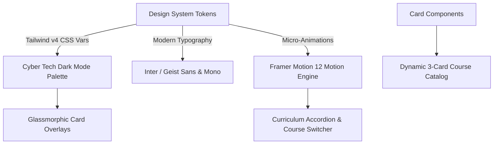
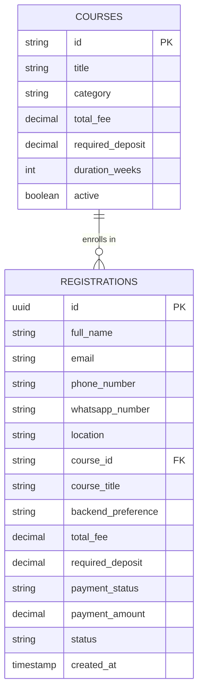

# Comprehensive Engineering Blueprint & UI/UX Design System Upgrade Plan

## Executive Summary & System Evolution Strategy

This document outlines the architectural transformation of **Gh0sT Tech** from a single-program landing page into an enterprise-grade, multi-course **Tech Training Academy & Student Management System**. 

The upgraded platform introduces three core career tracks:
1. **Practical Computer Systems & Engineering** (Hardware, OS, Networking, Repair)
2. **Office Productivity & Digital Literacy** (MS Word, Excel, PowerPoint, Computer Essentials)
3. **Full-Stack Web Development & AI Engineering** (HTML/CSS/JS, React & Next.js, Node.js/Express OR PHP + MySQL, AI Web Dev Tools)

---

## 🎨 UI/UX Design System & Aesthetic Upgrade Plan



### 1. Color Palette & Visual Theme Token Architecture
The visual aesthetic will adopt a **Cyber-Tech Modern Dark Mode** with high-contrast glowing accent colors tailored to each course category:

* **Primary Background**: Deep Obsidian (`#090d16` / `hsl(222, 47%, 6%)`)
* **Card Surface**: Glassmorphic Translucent Dark (`rgba(17, 24, 39, 0.6)` with `backdrop-filter: blur(12px)` and `border: 1px solid rgba(255, 255, 255, 0.08)`)
* **Track 1 Accent (Hardware)**: Neon Cyber Emerald (`#10b981` / `hsl(160, 84%, 39%)`)
* **Track 2 Accent (Office Productivity)**: Sapphire Cyan (`#06b6d4` / `hsl(189, 94%, 43%)`)
* **Track 3 Accent (Web Dev & AI)**: Electric Purple & Violet Gradient (`#8b5cf6` to `#ec4899` / `hsl(263, 90%, 66%)`)
* **Typography & Text Colors**: Primary White (`#f9fafb`), Muted Slate (`#9ca3af`), Vibrant Accent Glows.

### 2. Layout Structure & Responsive Grid Specs
* **Course Catalog Cards**:
  - **Desktop (≥ 1024px)**: 3-column responsive grid (`grid-cols-3 gap-8`).
  - **Tablet (768px – 1023px)**: 2-column grid with featured card span.
  - **Mobile (< 768px)**: Single column stack with swipeable touch indicators.
* **Interactive Course Card Design**:
  - **Header**: Category Badge (e.g. `MOST POPULAR`, `BEGINNER FRIENDLY`, `HIGH DEMAND`), Course Title, Duration Tag (e.g. `8 Weeks`).
  - **Price Badge**: Highlighted Total Fee & Deposit Breakdown (e.g. `GHS 1,000` / `Deposit: GHS 400`).
  - **Feature Highlights List**: 4 key takeaways with custom icons.
  - **Call to Action (CTA)**: Prominent glowing button linking directly to `/register?course=<track_id>`.

### 3. Motion System & Micro-Interactions
* **Scroll-Triggered Viewport Animations**: Smooth section entry (`opacity: 0, y: 30` to `opacity: 1, y: 0`) using Framer Motion 12.
* **Card Hover Effects**: Subtle 3D lift (`transform: translateY(-6px)`) with dynamic border glow matching the course accent color.
* **Tab Switcher Motion**: Smooth Layout Animation (`layoutId="activeTab"`) for seamless curriculum switching between courses.

---

## 🗄️ Database & Schema Migration Plan



### SQL Migration Script: `scripts/02-upgrade-courses-schema.sql`

```sql
-- Migration: Upgrade Registrations for Multi-Course Support
ALTER TABLE registrations 
ADD COLUMN IF NOT EXISTS course_id VARCHAR(100) DEFAULT 'hardware-engineering',
ADD COLUMN IF NOT EXISTS backend_preference VARCHAR(100) DEFAULT NULL,
ADD COLUMN IF NOT EXISTS total_fee DECIMAL(10, 2) DEFAULT 700.00,
ADD COLUMN IF NOT EXISTS required_deposit DECIMAL(10, 2) DEFAULT 300.00;

-- Create Courses lookup table
CREATE TABLE IF NOT EXISTS courses (
  id VARCHAR(100) PRIMARY KEY,
  title VARCHAR(255) NOT NULL,
  category VARCHAR(100) NOT NULL,
  duration_weeks INT NOT NULL,
  total_fee DECIMAL(10, 2) NOT NULL,
  required_deposit DECIMAL(10, 2) NOT NULL,
  is_active BOOLEAN DEFAULT true,
  created_at TIMESTAMP WITH TIME ZONE DEFAULT CURRENT_TIMESTAMP
);

-- Insert Default Course Catalog Records
INSERT INTO courses (id, title, category, duration_weeks, total_fee, required_deposit) VALUES
  ('hardware-engineering', 'Practical Computer Systems & Engineering', 'Hardware', 4, 700.00, 300.00),
  ('office-productivity', 'Office Productivity & Digital Literacy', 'Productivity', 3, 500.00, 200.00),
  ('web-dev-ai', 'Full-Stack Web Development & AI Engineering', 'Software', 8, 1000.00, 400.00)
ON CONFLICT (id) DO UPDATE SET
  total_fee = EXCLUDED.total_fee,
  required_deposit = EXCLUDED.required_deposit;
```

---

## 📚 Centralized Course Registry (`lib/courses-data.ts`)

Create a static TypeScript registry containing complete course details, syllabus modules, icons, and pricing rules:

```typescript
export interface CourseModule {
  week: string
  title: string
  topics: string[]
}

export interface Course {
  id: string
  slug: string
  title: string
  subtitle: string
  category: "Hardware" | "Productivity" | "Software"
  duration: string
  totalFee: number
  requiredDeposit: number
  badge?: string
  accentColor: string
  highlights: string[]
  syllabus: CourseModule[]
  hasBackendOption?: boolean
}

export const COURSES_CATALOG: Record<string, Course> = {
  "hardware-engineering": {
    id: "hardware-engineering",
    slug: "hardware-engineering",
    title: "Practical Computer Systems & Engineering",
    subtitle: "Master Hardware Assembly, OS Installation, Networking & Repair",
    category: "Hardware",
    duration: "4 Weeks",
    totalFee: 700,
    requiredDeposit: 300,
    badge: "Flagship Program",
    accentColor: "from-emerald-500 to-teal-600",
    highlights: [
      "PC Disassembly, Diagnostics & Reassembly",
      "Windows 10/11 Clean OS & Driver Installation",
      "Malware Removal, System Tuning & Partitioning",
      "RJ45 Cable Crimping & LAN Router Setup",
    ],
    syllabus: [
      { week: "Week 1", title: "Computer Architecture & Disassembly", topics: ["CPU, RAM, Motherboards & Power Supply", "Safe disassembling and reassembling"] },
      { week: "Week 2", title: "OS Deployment & Drivers", topics: ["Bootable USB creation", "Windows installation & drivers setup"] },
      { week: "Week 3", title: "Software Maintenance & Security", topics: ["Antivirus, malware cleaning", "Disk partitioning & data backup"] },
      { week: "Week 4", title: "Basic Networking & Troubleshooting", topics: ["Network cables crimping (RJ45)", "Router setup, IP addresses, diagnostic tools"] },
    ],
  },
  "office-productivity": {
    id: "office-productivity",
    slug: "office-productivity",
    title: "Office Productivity & Digital Literacy",
    subtitle: "Master Microsoft Word, Excel, PowerPoint & Everyday Computer Skills",
    category: "Productivity",
    duration: "3 Weeks",
    totalFee: 500,
    requiredDeposit: 200,
    badge: "Essential Skills",
    accentColor: "from-cyan-500 to-blue-600",
    highlights: [
      "Professional Document Design in MS Word",
      "MS Excel Formulas, Functions & Data Entry",
      "MS PowerPoint Slide Presentations",
      "Internet Research, Email Etiquette & Cloud Storage",
    ],
    syllabus: [
      { week: "Week 1", title: "Microsoft Word Mastery", topics: ["Document formatting, headers/footers", "Table design, reports, printing"] },
      { week: "Week 2", title: "Microsoft Excel Essentials", topics: ["Spreadsheet basics, formulas (SUM, AVERAGE, IF)", "Data formatting, charts & pivot tables"] },
      { week: "Week 3", title: "PowerPoint & Digital Workspace", topics: ["Slide animations, pitch decks", "Email management, Google Drive, typing speed"] },
    ],
  },
  "web-dev-ai": {
    id: "web-dev-ai",
    slug: "web-dev-ai",
    title: "Full-Stack Web Development & AI Engineering",
    subtitle: "Build Modern Web Apps with HTML/CSS, React, Next.js, Node/PHP, MySQL & AI Tools",
    category: "Software",
    duration: "8 Weeks",
    totalFee: 1000,
    requiredDeposit: 400,
    badge: "High Demand",
    accentColor: "from-violet-500 to-fuchsia-600",
    hasBackendOption: true,
    highlights: [
      "Responsive Layouts with HTML5, CSS3 & Tailwind",
      "Modern JavaScript (ES6+) & React Components",
      "Next.js App Router & Server Components",
      "Backend in Node.js/Express OR PHP + MySQL DB",
      "AI Coding Assistance (ChatGPT, V0, Copilot)",
    ],
    syllabus: [
      { week: "Weeks 1-2", title: "Web Foundations & AI Prompting", topics: ["HTML5 semantics, CSS3 Flexbox/Grid", "JavaScript ES6 fundamentals", "AI-assisted coding with V0 & Copilot"] },
      { week: "Weeks 3-4", title: "Modern Frontend (React & Next.js)", topics: ["React JSX, State, Hooks", "Next.js App Router, SSR, Tailwind CSS UI"] },
      { week: "Weeks 5-6", title: "Database Engineering (MySQL)", topics: ["Database schema design, SQL queries", "CRUD operations, table joins"] },
      { week: "Weeks 7-8", title: "Backend APIs & Project Deployment", topics: ["REST APIs in Node.js/Express OR PHP", "Connecting frontend to backend", "Hosting & Domain setup"] },
    ],
  },
}
```

---

## 🛠️ Code Modification Breakdown & Component Architecture

### 1. [MODIFY] [components/courses-section.tsx](file:///e:/gh0s-t-tech-website/components/courses-section.tsx)
* **Goal**: Replace single-course display with a 3-card glassmorphic course catalog.
* **Implementation Details**:
  - Map over `COURSES_CATALOG`.
  - Display course badges, pricing (Total Fee & Deposit), duration, and highlight bullet points.
  - Action button: `Link href={`/register?course=${course.id}`}` for direct pre-selection.

### 2. [MODIFY] [components/curriculum-section.tsx](file:///e:/gh0s-t-tech-website/components/curriculum-section.tsx)
* **Goal**: Enable prospective students to switch between course tabs to view weekly modules.
* **Implementation Details**:
  - Add Radix UI Tabs / Custom Framer Motion Tab buttons (`Hardware`, `Office Productivity`, `Web Dev & AI`).
  - Render week-by-week accordions dynamically based on active tab.

### 3. [MODIFY] [components/registration-form.tsx](file:///e:/gh0s-t-tech-website/components/registration-form.tsx)
* **Goal**: Upgrade multi-step registration wizard to support dynamic course selection and pricing.
* **Step 1 (Course Selection)**:
  - Read `?course=` query parameter via `useSearchParams()`.
  - Render interactive course cards. When selected, automatically updates state `selectedCourseId`.
  - If `selectedCourseId === "web-dev-ai"`, render radio group for **Backend Preference**:
    - `Option A`: Node.js + Express & MySQL
    - `Option B`: PHP & MySQL
  - Display live price card (Total Fee: GHS X, Deposit Required: GHS Y).
* **Step 2 & 3**: Existing validation rules updated to check `selectedCourseId` and optional `backend_preference`.

### 4. [MODIFY] [app/api/registrations/create/route.ts](file:///e:/gh0s-t-tech-website/app/api/registrations/create/route.ts)
* **Goal**: Server-side validation and Supabase record insertion for multi-course data.
* **Validation Schema**:
  ```typescript
  const schema = z.object({
    full_name: z.string().min(2).max(255),
    phone_number: z.string().min(8).max(20),
    whatsapp_number: z.string().min(8).max(20),
    email: z.string().email().max(255),
    location: z.string().min(2).max(255),
    course_selection: z.string().min(2).max(100), // course id
    backend_preference: z.string().optional(),
    previous_knowledge: z.boolean(),
    education_level: z.string().optional(),
    experience_level: z.string().optional(),
    motivation: z.string().optional(),
  })
  ```
* **Payload Generation**:
  - Look up course from `COURSES_CATALOG`.
  - Assign `total_fee` and `required_deposit`.
  - Insert payload into Supabase `registrations` table.

### 5. [MODIFY] [app/register/payment/page.tsx](file:///e:/gh0s-t-tech-website/app/register/payment/page.tsx)
* **Goal**: Dynamic Paystack initialization based on course deposit amount.
* **Implementation Details**:
  - Fetch registration record by `registrationId`.
  - Retrieve `required_deposit` (e.g. GHS 300, GHS 200, or GHS 400).
  - Pass correct deposit amount in kobo (`required_deposit * 100`) to `/api/payments/paystack/initialize`.

### 6. [MODIFY] [lib/email-utils.ts](file:///e:/gh0s-t-tech-website/lib/email-utils.ts)
* **Goal**: Tailor HTML confirmation emails to the student's chosen course.
* **Implementation Details**:
  - Update `emailTemplates.registration` and `adminAlert` to print selected course title, backend choice (if Web Dev), and exact deposit/total fee.

### 7. [MODIFY] [app/admin/registrations/page.tsx](file:///e:/gh0s-t-tech-website/app/admin/registrations/page.tsx)
* **Goal**: Enhance admin dashboard to filter and inspect multi-course registrations.
* **Implementation Details**:
  - Add Course Filter select dropdown (`All Courses`, `Hardware`, `Office Productivity`, `Web Dev & AI`).
  - Update student details modal to highlight course title, backend preference, total fee, and deposit status.

---

## 🧪 Verification & Quality Assurance Plan

### 1. Build & Compilation Verification
- Execute `npm run build` in the shell to ensure zero TypeScript errors, broken imports, or Next.js layout warnings.

### 2. Registration & Paystack Pipeline Verification
- **Test Case 1 (Hardware Course)**: Select Hardware course -> Verify GHS 300 deposit prompt on checkout.
- **Test Case 2 (Office Productivity)**: Select Office Productivity -> Verify GHS 200 deposit prompt on checkout.
- **Test Case 3 (Web Dev & AI)**: Select Web Dev & AI -> Choose Node.js/Express backend -> Verify GHS 400 deposit prompt on checkout.

### 3. Administrative Portal Verification
- Log into `/gh0st-secure-access` with MFA.
- Filter student table by course.
- Verify detailed student modal displays course selection and backend preference accurately.
